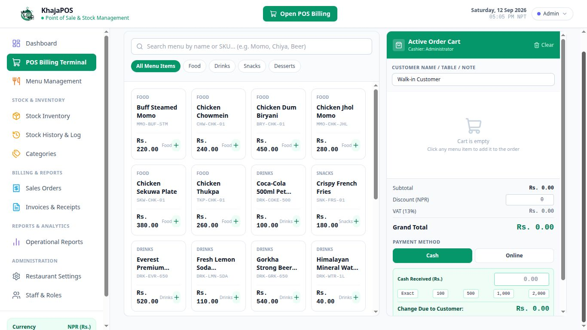
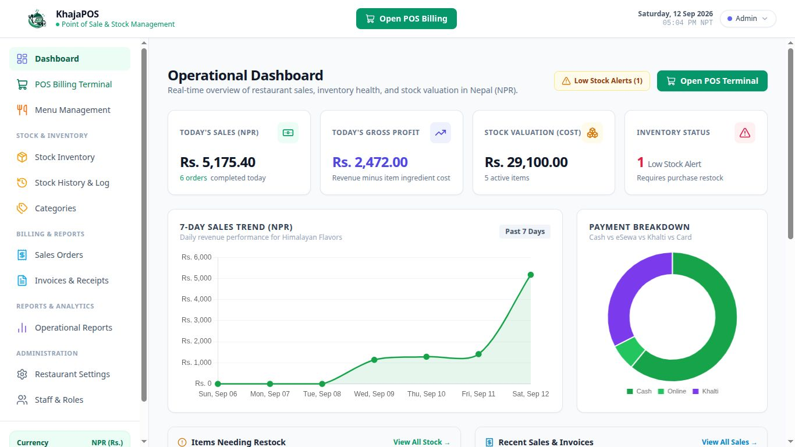
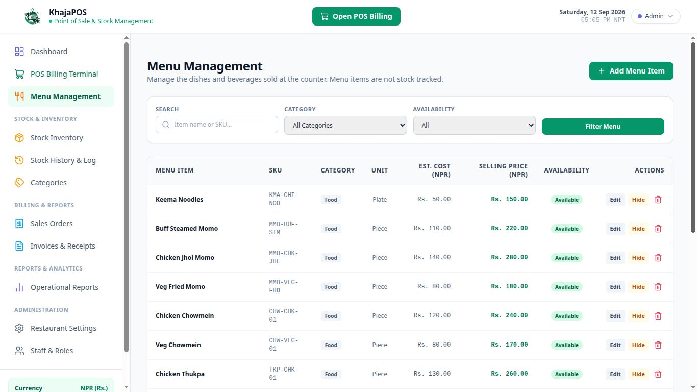

<div align="center">


# KhajaPOS

### Restaurant Point of Sale, Inventory and Billing System

[](composer.json)
[](composer.json)
[](config/database.php)
[](https://github.com/ankitkhatrik6/KhajaPOS/releases)
[](LICENSE)
[](routes/web.php)

</div>

## About

KhajaPOS is a production-ready restaurant point of sale, stock management and billing platform built with PHP and the Laravel framework. It is designed for real-world restaurants and cafes that need a fast cash counter, an accurate inventory ledger and clean VAT-compliant receipts all in one place.

The system runs entirely on MySQL or MariaDB and is served by PHP, which makes it an excellent fit for local deployment with XAMPP on a single machine or across a small office network. All transactions are recorded in NPR and every sale automatically deducts stock in real time.

## Two versions — Web & Desktop App

KhajaPOS runs in **two separate versions** of the same application so you can pick the one that fits your counter:

| Version | Where it runs | Best for |
| ------- | ------------- | -------- |
| 🌐 **Web (Browser)** | Your web browser via `php artisan serve` + MySQL/MariaDB | Developers and existing PHP/MySQL (XAMPP) setups |
| 🖥 **Desktop App (Linux)** | A native GTK/WebKit desktop window + a local server | POS counters — one command installs everything |

- **Web version** → the repository root below ([Web (Browser) Version](#web-browser-version)); quick start with `./run-web.sh`.
- **Desktop App (Linux)** → [desktop/README.md](desktop/README.md) (download + full setup guide) and the ready-to-install `.deb` package in the [Downloads](#downloads-linux) section.

## Features

- Point of Sale terminal with instant item search and category filters
- Cash and online payment methods with change calculation for cash notes
- Separate menu and raw-material inventory — dishes are billed with quantity only and are not stock tracked
- Raw material stock management with automatic low stock alerts and history, including restock, adjustment and damage logs
- Category and menu management for food, drinks, snacks and desserts
- VAT-compliant tax invoice generation in printable A4 and 80mm thermal receipt formats
- Sales, payment method and profit reporting in NPR
- Role based access for admin, cashier and stock manager accounts
- Navigation is role aware — each staff member only sees the sections their role can access
- Admin-only permanent deletion of staff, invoices, stock items, categories and menu items
- Responsive light themed interface that works on desktop and mobile browsers
- Live operational dashboard with sales trends and payment distribution charts

## Tech Stack

| Layer       | Technology                              |
| ----------- | --------------------------------------- |
| Backend     | PHP 8.2, Laravel 12                     |
| Frontend    | Blade templates, Tailwind CSS, Lucide   |
| Database    | MySQL or MariaDB                        |
| Server      | PHP built-in server or XAMPP Apache     |
| Desktop App | GTK3 + WebKit2GTK (Python3), systemd    |
| Tooling     | Composer, Git, GitHub Actions           |

## Downloads (Linux)

> **Recommended:** install the [**KhajaPOS Desktop App** for Linux](desktop/README.md) — it installs PHP, MariaDB/MySQL and the desktop application automatically on Debian / Ubuntu.

| Platform | Package | Version | Install command |
| -------- | ------- | ------- | --------------- |
| 🐧 Debian / Ubuntu | [khajapos_2.2.4-1_all.deb](desktop/khajapos_2.2.4-1_all.deb) | 2.2.4 | `sudo apt install ./khajapos_2.2.4-1_all.deb` |
| 🐧 Latest build | [GitHub Releases](https://github.com/ankitkhatrik6/KhajaPOS/releases) | latest | download the `.deb` from the release page |

Full Linux download + setup instructions — requirements, install, launch, upgrade, uninstall and troubleshooting:
**[desktop/README.md](desktop/README.md)**.

## Screenshots

### POS Billing Terminal



### Operational Dashboard



### Menu Management



## Web (Browser) Version

Run the full POS in any web browser. This is the developer / local-server
version; the only requirements are PHP and MySQL or MariaDB (XAMPP on Linux
works great).

### Prerequisites

- PHP 8.2 or newer
- MySQL or MariaDB (XAMPP recommended)
- Composer 2.x (only required when reinstalling dependencies)

### Installation

1. Clone the repository:

   ```bash
   git clone https://github.com/ankitkhatrik6/KhajaPOS.git
   cd KhajaPOS
   ```

2. Install PHP dependencies (optional because the vendor directory is committed):

   ```bash
   composer install
   ```

3. Prepare the environment file and generate an application key:

   ```bash
   cp .env.example .env
   php artisan key:generate
   ```

4. Configure the database credentials inside the `.env` file to match your MySQL or MariaDB server.

5. Create the database, run migrations and seed demo data:

   ```bash
   php artisan migrate
   php artisan db:seed
   ```

6. Start the development server:

   ```bash
   ./run-web.sh                   # XAMPP: starts MySQL + the web server on :3000
   # or manually:
   sudo /opt/lampp/lampp startmysql
   php artisan serve --host=0.0.0.0 --port=3000
   ```

7. Open the application and sign in:

   ```text
   http://localhost:3000
   ```

### Default Accounts

The database seeder creates a single administrator account (roles for Cashier and Stock Manager can be assigned to additional staff from Settings → Staff & Roles):

| Role  | Email              | Password      | Access             |
| ----- | ------------------ | ------------- | ------------------ |
| Admin | admin@khajapos.com | KhajaPOS@123  | Full system access |

### Role Based Section Visibility

The sidebar (desktop) and mobile drawer only display the sections a role is allowed to open — access is still enforced server side on every route:

| Section             | Admin | Cashier | Stock Manager |
| ------------------- | :---: | :-----: | :-----------: |
| POS Billing         |  ✓    |    ✓    |      ✗        |
| Sales & Invoices    |  ✓    |    ✓    |      ✗        |
| Stock & Inventory   |  ✓    |    ✗    |      ✓        |
| Categories          |  ✓    |    ✗    |      ✓        |
| Operational Reports |  ✓    |    ✗    |      ✓        |
| Menu Management     |  ✓    |    ✗    |      ✗        |
| Settings / Staff    |  ✓    |    ✗    |      ✗        |

### Permanent Deletion (Admin Only)

Any destructive action is restricted to the **Admin** role:

- **Staff & Roles → trash icon** permanently removes a user. Guards: you cannot delete your own account, the last active admin, or anyone with recorded sales history (deactivate those instead).
- **Invoices → trash icon** permanently deletes an invoice together with its linked sale, line items and payments.
- **Stock Inventory → Edit → Delete Material** permanently deletes an item and its full stock history.
- Content blocks with dependants (categories that still have menu/stock items) are rejected to protect historical records.

## Desktop App (Linux)

The **Desktop App** version packages the exact same application into a native
GTK/WebKit window with a local server. It installs PHP, MariaDB/MySQL, the
server auto-start and the app menu entry automatically:

```bash
sudo apt install ./khajapos_2.2.4-1_all.deb
khajapos app      # or click "KhajaPOS" in the application menu
```

> Full download, setup, upgrade and troubleshooting guide:
> **[desktop/README.md](desktop/README.md)**. Build the package yourself with
> [desktop/build-deb.sh](desktop/build-deb.sh) (see [desktop/BUILD.md](desktop/BUILD.md)).

## Payments

KhajaPOS supports two payment methods on the POS terminal:

- Cash, with quick note presets and automatic change calculation
- Online, with an optional transaction reference field

## Project Structure

```text
app/            Models, services, controllers and middleware
config/         Application configuration files
routes/         HTTP routes
resources/      Blade views and static assets
public/         Public files including images and the entry point
database/       Migrations and seeders
tests/          Unit and feature tests
desktop/        Desktop App (Linux) version - .deb package, build scripts and
                the Linux download & setup guide
 .github/       GitHub Actions workflows (automatic .deb builds on releases)
```

## Contributing

Contributions are welcome. Please open an issue or submit a pull request with a clear description of the change.

## License

This project is licensed under the MIT License. See the [LICENSE](LICENSE) file for details. Copyright (c) 2026 Ankit Khatri KC.
